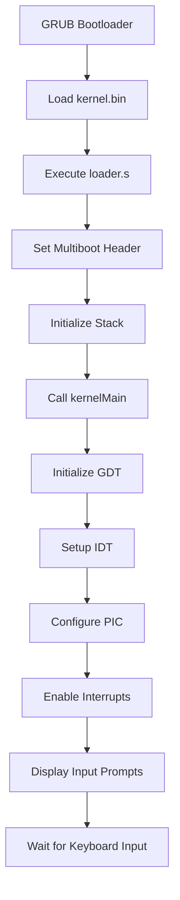
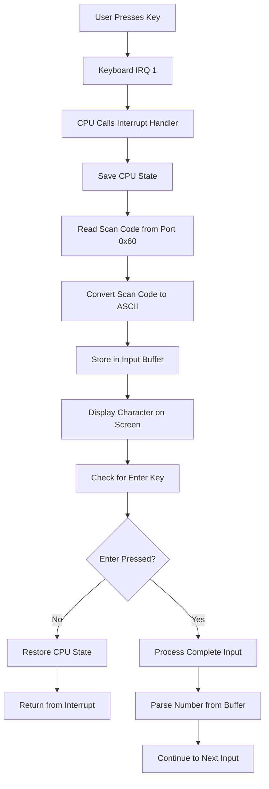
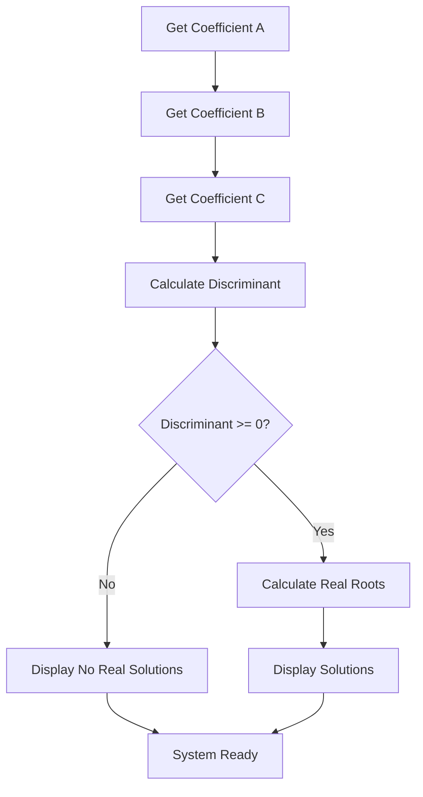

## Enhanced Project Structure with Keyboard Input

### Directory Organization

```
wyoos-lab13-keyboard/
├── src/
│   ├── loader.s
│   ├── kernel.cpp
│   ├── interrupts.cpp
│   ├── interrupts.s
│   ├── keyboard.cpp
│   ├── gdt.cpp
│   ├── gdt.h
│   ├── port.cpp
│   ├── port.h
│   ├── linker.ld
│   └── types.h
├── Makefile
└── README.md
```

## Implementation Flowchart

### Boot and Initialization Process



### Keyboard Input Handling



### Quadratic Equation Solving



## Source Code Implementation

### 1. Enhanced Loader (src/loader.s)

**Location**: `src/loader.s`

```assembly
.set MAGIC, 0x1badb002
.set FLAGS, (1<<0 | 1<<1)
.set CHECKSUM, -(MAGIC + FLAGS)

.section .multiboot
    .long MAGIC
    .long FLAGS
    .long CHECKSUM

.section .text
.extern kernelMain
.extern callConstructors
.global loader

loader:
    mov $kernel_stack, %esp
    call callConstructors
    push %eax
    push %ebx
    call kernelMain

_stop:
    cli
    hlt
    jmp _stop

.section .bss
.space 2*1024*1024
kernel_stack:
```

### 2. Type Definitions (src/types.h)

**Location**: `src/types.h`

```cpp
#ifndef _TYPES_H_
#define _TYPES_H_

typedef unsigned char      uint8_t;
typedef unsigned short     uint16_t;
typedef unsigned int       uint32_t;
typedef unsigned long long uint64_t;

typedef char               int8_t;
typedef short              int16_t;
typedef int                int32_t;
typedef long long          int64_t;

#endif
```

### 3. Port I/O Abstraction (src/port.h)

**Location**: `src/port.h`

```cpp
#ifndef _PORT_H_
#define _PORT_H_

#include "types.h"

class Port
{
protected:
    Port(uint16_t portnum);
    ~Port();
    uint16_t portnumber;
};

class Port8Bit : public Port
{
public:
    Port8Bit(uint16_t portnum);
    ~Port8Bit();
    
    virtual void Write(uint8_t data);
    virtual uint8_t Read();
};

class Port8BitSlow : public Port8Bit
{
public:
    Port8BitSlow(uint16_t portnum);
    ~Port8BitSlow();
    void Write(uint8_t data);
};

#endif
```

### 4. Port I/O Implementation (src/port.cpp)

**Location**: `src/port.cpp`

```cpp
#include "port.h"

Port::Port(uint16_t portnum)
{
    portnumber = portnum;
}

Port::~Port()
{
}

Port8Bit::Port8Bit(uint16_t portnum)
    : Port(portnum)
{
}

Port8Bit::~Port8Bit()
{
}

void Port8Bit::Write(uint8_t data)
{
    __asm__ volatile("outb %0, %1" : : "a" (data), "Nd" (portnumber));
}

uint8_t Port8Bit::Read()
{
    uint8_t result;
    __asm__ volatile("inb %1, %0" : "=a" (result) : "Nd" (portnumber));
    return result;
}

Port8BitSlow::Port8BitSlow(uint16_t portnum)
    : Port8Bit(portnum)
{
}

Port8BitSlow::~Port8BitSlow()
{
}

void Port8BitSlow::Write(uint8_t data)
{
    __asm__ volatile("outb %0, %1\njmp 1f\n1: jmp 1f\n1:" : : "a" (data), "Nd" (portnumber));
}
```

### 5. GDT Header (src/gdt.h)

**Location**: `src/gdt.h`

```cpp
#ifndef _GDT_H_
#define _GDT_H_

#include "types.h"

class GlobalDescriptorTable
{
public:
    
    class SegmentDescriptor
    {
    private:
        uint16_t limit_lo;
        uint16_t base_lo;
        uint8_t base_hi;
        uint8_t type;
        uint8_t flags_limit_hi;
        uint8_t base_vhi;
        
    public:
        SegmentDescriptor(uint32_t base, uint32_t limit, uint8_t type);
        uint32_t Base();
        uint32_t Limit();
    } __attribute__((packed));
    
    SegmentDescriptor nullSegmentSelector;
    SegmentDescriptor unusedSegmentSelector;
    SegmentDescriptor codeSegmentSelector;
    SegmentDescriptor dataSegmentSelector;
    
public:
    GlobalDescriptorTable();
    ~GlobalDescriptorTable();
    
    uint16_t CodeSegmentSelector();
    uint16_t DataSegmentSelector();
};

#endif
```

### 6. GDT Implementation (src/gdt.cpp)

**Location**: `src/gdt.cpp`

```cpp
#include "gdt.h"

GlobalDescriptorTable::GlobalDescriptorTable()
    : nullSegmentSelector(0, 0, 0),
      unusedSegmentSelector(0, 0, 0),
      codeSegmentSelector(0, 64*1024*1024, 0x9A),
      dataSegmentSelector(0, 64*1024*1024, 0x92)
{
    uint32_t i[2];
    i[1] = (uint32_t)this;
    i[0] = sizeof(GlobalDescriptorTable) << 16;
    asm volatile("lgdt (%0)": :"p" (((uint8_t *) i)+2));
}

GlobalDescriptorTable::~GlobalDescriptorTable()
{
}

uint16_t GlobalDescriptorTable::DataSegmentSelector()
{
    return (uint8_t*)&dataSegmentSelector - (uint8_t*)this;
}

uint16_t GlobalDescriptorTable::CodeSegmentSelector()
{
    return (uint8_t*)&codeSegmentSelector - (uint8_t*)this;
}

GlobalDescriptorTable::SegmentDescriptor::SegmentDescriptor(uint32_t base, uint32_t limit, uint8_t type)
{
    uint8_t* target = (uint8_t*)this;
    
    if (limit <= 65536)
    {
        target[6] = 0x40;
    }
    else
    {
        if((limit & 0xFFF) != 0xFFF)
            limit = (limit >> 12)-1;
        else
            limit = limit >> 12;
            
        target[6] = 0xC0;
    }

    target[0] = limit & 0xFF;
    target[1] = (limit >> 8) & 0xFF;
    target[6] |= (limit >> 16) & 0xF;
    
    target[2] = base & 0xFF;
    target[3] = (base >> 8) & 0xFF;
    target[4] = (base >> 16) & 0xFF;
    target[7] = (base >> 24) & 0xFF;
    
    target[5] = type;
}

uint32_t GlobalDescriptorTable::SegmentDescriptor::Base()
{
    uint8_t* target = (uint8_t*)this;
    uint32_t result = target[7];
    result = (result << 8) + target[4];
    result = (result << 8) + target[3];
    result = (result << 8) + target[2];
    return result;
}

uint32_t GlobalDescriptorTable::SegmentDescriptor::Limit()
{
    uint8_t* target = (uint8_t*)this;
    uint32_t result = target[6] & 0xF;
    result = (result << 8) + target[1];
    result = (result << 8) + target[0];
    
    if(target[6] & 0xC0 == 0xC0)
        result = (result << 12) | 0xFFF;
    return result;
}
```

### 7. Interrupt System (src/interrupts.cpp)

**Location**: `src/interrupts.cpp`

```cpp
#include "interrupts.h"

void printf(const char* str);

InterruptManager::GateDescriptor InterruptManager::interruptDescriptorTable[256];

void InterruptManager::SetInterruptDescriptorTableEntry(uint8_t interrupt,
    uint16_t CodeSegmentSelectorOffset, void (*handler)(),
    uint8_t DescriptorPrivilegeLevel, uint8_t DescriptorType)
{
    interruptDescriptorTable[interrupt].handlerAddressLowBits = ((uint32_t) handler) & 0xFFFF;
    interruptDescriptorTable[interrupt].handlerAddressHighBits = (((uint32_t) handler) >> 16) & 0xFFFF;
    interruptDescriptorTable[interrupt].gdtCodeSegmentSelector = CodeSegmentSelectorOffset;
    
    const uint8_t IDT_DESC_PRESENT = 0x80;
    interruptDescriptorTable[interrupt].access = IDT_DESC_PRESENT | ((DescriptorPrivilegeLevel & 3) << 5) | DescriptorType;
    interruptDescriptorTable[interrupt].reserved = 0;
}

InterruptManager::InterruptManager(uint16_t hardwareInterruptOffset, GlobalDescriptorTable* globalDescriptorTable)
    : programmableInterruptControllerMasterCommandPort(0x20),
      programmableInterruptControllerMasterDataPort(0x21),
      programmableInterruptControllerSlaveCommandPort(0xA0),
      programmableInterruptControllerSlaveDataPort(0xA1)
{
    this->hardwareInterruptOffset = hardwareInterruptOffset;
    uint32_t CodeSegment = globalDescriptorTable->CodeSegmentSelector();

    const uint8_t IDT_INTERRUPT_GATE = 0xE;
    for(uint8_t i = 255; i > 0; --i)
    {
        SetInterruptDescriptorTableEntry(i, CodeSegment, &IgnoreInterruptRequest, 0, IDT_INTERRUPT_GATE);
    }
    SetInterruptDescriptorTableEntry(0, CodeSegment, &IgnoreInterruptRequest, 0, IDT_INTERRUPT_GATE);

    SetInterruptDescriptorTableEntry(hardwareInterruptOffset + 0x00, CodeSegment, &HandleInterruptRequest0x00, 0, IDT_INTERRUPT_GATE);
    SetInterruptDescriptorTableEntry(hardwareInterruptOffset + 0x01, CodeSegment, &HandleInterruptRequest0x01, 0, IDT_INTERRUPT_GATE);

    programmableInterruptControllerMasterCommandPort.Write(0x11);
    programmableInterruptControllerSlaveCommandPort.Write(0x11);

    programmableInterruptControllerMasterDataPort.Write(hardwareInterruptOffset);
    programmableInterruptControllerSlaveDataPort.Write(hardwareInterruptOffset+8);

    programmableInterruptControllerMasterDataPort.Write(0x04);
    programmableInterruptControllerSlaveDataPort.Write(0x02);

    programmableInterruptControllerMasterDataPort.Write(0x01);
    programmableInterruptControllerSlaveDataPort.Write(0x01);

    programmableInterruptControllerMasterDataPort.Write(0x00);
    programmableInterruptControllerSlaveDataPort.Write(0x00);

    InterruptDescriptorTablePointer idt;
    idt.size  = 256 * sizeof(GateDescriptor) - 1;
    idt.base  = (uint32_t)interruptDescriptorTable;
    asm volatile("lidt %0" : : "m" (idt));
}

InterruptManager::~InterruptManager()
{
    Deactivate();
}

uint16_t InterruptManager::HardwareInterruptOffset()
{
    return hardwareInterruptOffset;
}

void InterruptManager::Activate()
{
    asm("sti");
}

void InterruptManager::Deactivate()
{
    asm("cli");
}

uint32_t InterruptManager::HandleInterrupt(uint8_t interrupt, uint32_t esp)
{
    if(hardwareInterruptOffset <= interrupt && interrupt < hardwareInterruptOffset+16)
    {
        if(interrupt == hardwareInterruptOffset + 1)
        {
            HandleKeyboardInterrupt();
        }
        
        programmableInterruptControllerMasterCommandPort.Write(0x20);
        if(hardwareInterruptOffset + 8 <= interrupt)
            programmableInterruptControllerSlaveCommandPort.Write(0x20);
    }
    
    return esp;
}

void InterruptManager::HandleKeyboardInterrupt()
{
    Port8Bit dataport(0x60);
    uint8_t key = dataport.Read();
    
    static char* keyboardmap =
        "  1234567890-=  qwertyuiop[]  asdfghjkl;'` \\zxcvbnm,./   ";
    
    if(key < 58)
    {
        ProcessKeyboardInput(keyboardmap[key]);
    }
}
```

### 8. Interrupt Header (src/interrupts.h)

**Location**: `src/interrupts.h`

```cpp
#ifndef _INTERRUPTS_H_
#define _INTERRUPTS_H_

#include "types.h"
#include "port.h"
#include "gdt.h"

class InterruptManager
{
    friend class InterruptHandler;
    
protected:
    
    static InterruptManager* ActiveInterruptManager;

    struct GateDescriptor
    {
        uint16_t handlerAddressLowBits;
        uint16_t gdtCodeSegmentSelector;
        uint8_t reserved;
        uint8_t access;
        uint16_t handlerAddressHighBits;
    } __attribute__((packed));
    
    static GateDescriptor interruptDescriptorTable[256];

    struct InterruptDescriptorTablePointer
    {
        uint16_t size;
        uint32_t base;
    } __attribute__((packed));
    
    uint16_t hardwareInterruptOffset;
    static void SetInterruptDescriptorTableEntry(uint8_t interrupt,
        uint16_t codeSegmentSelectorOffset, void (*handler)(),
        uint8_t DescriptorPrivilegeLevel, uint8_t DescriptorType);

    Port8BitSlow programmableInterruptControllerMasterCommandPort;
    Port8BitSlow programmableInterruptControllerMasterDataPort;
    Port8BitSlow programmableInterruptControllerSlaveCommandPort;
    Port8BitSlow programmableInterruptControllerSlaveDataPort;

public:
    InterruptManager(uint16_t hardwareInterruptOffset, GlobalDescriptorTable* globalDescriptorTable);
    ~InterruptManager();
    uint16_t HardwareInterruptOffset();
    void Activate();
    void Deactivate();
    
    static uint32_t HandleInterrupt(uint8_t interrupt, uint32_t esp);
    
    static void IgnoreInterruptRequest();
    static void HandleInterruptRequest0x00();
    static void HandleInterruptRequest0x01();
    
    void HandleKeyboardInterrupt();
};

void ProcessKeyboardInput(char c);

#endif
```

### 9. Assembly Interrupt Handlers (src/interrupts.s)

**Location**: `src/interrupts.s`

```assembly
.set IRQ_BASE, 0x20

.section .text

.extern _ZN16InterruptManager15HandleInterruptEhj

.global _ZN16InterruptManager22IgnoreInterruptRequestEv

.macro HandleException num
.global _ZN16InterruptManager19HandleException\num\()Ev
_ZN16InterruptManager19HandleException\num\()Ev:
    movb $\num, (interruptnumber)
    jmp int_bottom
.endm

.macro HandleInterruptRequest num
.global _ZN16InterruptManager26HandleInterruptRequest\num\()Ev
_ZN16InterruptManager26HandleInterruptRequest\num\()Ev:
    movb $\num + IRQ_BASE, (interruptnumber)
    jmp int_bottom
.endm

HandleInterruptRequest 0x00
HandleInterruptRequest 0x01

int_bottom:
    pusha
    pushl %ds
    pushl %es
    pushl %fs
    pushl %gs
    
    pushl %esp
    push (interruptnumber)
    call _ZN16InterruptManager15HandleInterruptEhj
    add $8, %esp
    mov %eax, %esp
    
    popl %gs
    popl %fs
    popl %es
    popl %ds
    popa

_ZN16InterruptManager22IgnoreInterruptRequestEv:
    iret

.data
    interruptnumber: .byte 0
```

### 10. Keyboard Handler (src/keyboard.cpp)

**Location**: `src/keyboard.cpp`

```cpp
#include "types.h"

void printf(const char* str);
void printNum(int32_t num);

static char input_buffer[32];
static int input_pos = 0;
static bool input_ready = false;

static int coefficient_stage = 0;
static int32_t a = 0, b = 0, c = 0;

void ProcessKeyboardInput(char key)
{
    if(key == '\n' || key == '\r')
    {
        input_buffer[input_pos] = '\0';
        input_ready = true;
        printf("\n");
        
        int32_t number = 0;
        bool negative = false;
        int start = 0;
        
        if(input_buffer[0] == '-')
        {
            negative = true;
            start = 1;
        }
        
        for(int i = start; i < input_pos; i++)
        {
            if(input_buffer[i] >= '0' && input_buffer[i] <= '9')
            {
                number = number * 10 + (input_buffer[i] - '0');
            }
        }
        
        if(negative) number = -number;
        
        switch(coefficient_stage)
        {
            case 0:
                a = number;
                coefficient_stage = 1;
                printf("Enter coefficient b: ");
                break;
            case 1:
                b = number;
                coefficient_stage = 2;
                printf("Enter coefficient c: ");
                break;
            case 2:
                c = number;
                coefficient_stage = 3;
                SolveQuadraticEquation();
                break;
        }
        
        input_pos = 0;
        input_ready = false;
    }
    else if(key == '\b')
    {
        if(input_pos > 0)
        {
            input_pos--;
            printf("\b \b");
        }
    }
    else if(key >= ' ' && key <= '~' && input_pos < 31)
    {
        input_buffer[input_pos] = key;
        input_pos++;
        
        char temp[2];
        temp[0] = key;
        temp[1] = '\0';
        printf(temp);
    }
}

void SolveQuadraticEquation()
{
    printf("\nSolving equation: ");
    printNum(a);
    printf("x^2 + ");
    printNum(b);
    printf("x + ");
    printNum(c);
    printf(" = 0\n");
    
    if(a == 0)
    {
        printf("Not a quadratic equation (a = 0)\n");
        if(b != 0)
        {
            printf("Linear solution: x = ");
            printNum(-c / b);
            printf("\n");
        }
        else
        {
            printf("No solution\n");
        }
        return;
    }
    
    int32_t discriminant = b * b - 4 * a * c;
    
    printf("Discriminant = ");
    printNum(discriminant);
    printf("\n");
    
    if(discriminant > 0)
    {
        printf("Two real solutions exist\n");
        
        int32_t sqrt_disc = 0;
        for(int32_t i = 1; i * i <= discriminant; i++)
        {
            if(i * i == discriminant)
            {
                sqrt_disc = i;
                break;
            }
        }
        
        if(sqrt_disc > 0)
        {
            int32_t x1 = (-b + sqrt_disc) / (2 * a);
            int32_t x2 = (-b - sqrt_disc) / (2 * a);
            
            printf("x1 = ");
            printNum(x1);
            printf("\n");
            printf("x2 = ");
            printNum(x2);
            printf("\n");
        }
        else
        {
            printf("Solutions involve square roots\n");
            printf("x1 = (-");
            printNum(b);
            printf(" + sqrt(");
            printNum(discriminant);
            printf(")) / ");
            printNum(2 * a);
            printf("\n");
            printf("x2 = (-");
            printNum(b);
            printf(" - sqrt(");
            printNum(discriminant);
            printf(")) / ");
            printNum(2 * a);
            printf("\n");
        }
    }
    else if(discriminant == 0)
    {
        printf("One real solution exists\n");
        int32_t x = -b / (2 * a);
        printf("x = ");
        printNum(x);
        printf("\n");
    }
    else
    {
        printf("No real solutions (complex solutions)\n");
    }
    
    printf("\nPress any key to solve another equation...\n");
    coefficient_stage = 0;
    a = b = c = 0;
}

void StartQuadraticSolver()
{
    printf("QUADRATIC EQUATION SOLVER\n");
    printf("ax^2 + bx + c = 0\n\n");
    printf("Enter coefficient a: ");
    coefficient_stage = 0;
}
```

### 11. Main Kernel (src/kernel.cpp)

**Location**: `src/kernel.cpp`

```cpp
#include "types.h"
#include "gdt.h"
#include "interrupts.h"

void printf(const char* str)
{
    static uint16_t* VideoMemory = (uint16_t*)0xb8000;
    static uint8_t x = 0, y = 0;

    for(int i = 0; str[i] != '\0'; ++i)
    {
        switch(str[i])
        {
            case '\n':
                x = 0;
                y++;
                break;
            case '\r':
                x = 0;
                break;
            case '\b':
                if(x > 0) {
                    x--;
                    VideoMemory[80*y+x] = (VideoMemory[80*y+x] & 0xFF00) | ' ';
                }
                break;
            default:
                VideoMemory[80*y+x] = (VideoMemory[80*y+x] & 0xFF00) | str[i];
                x++;
                break;
        }

        if(x >= 80)
        {
            x = 0;
            y++;
        }

        if(y >= 25)
        {
            for(y = 0; y < 25; y++)
                for(x = 0; x < 80; x++)
                    VideoMemory[80*y+x] = (VideoMemory[80*y+x] & 0xFF00) | ' ';
            x = 0;
            y = 0;
        }
    }
}

void printNum(int32_t num)
{
    if(num == 0)
    {
        printf("0");
        return;
    }
    
    if(num < 0)
    {
        printf("-");
        num = -num;
    }
    
    char buffer[16];
    int pos = 0;
    
    while(num > 0)
    {
        buffer[pos] = '0' + (num % 10);
        num = num / 10;
        pos++;
    }
    
    for(int i = pos - 1; i >= 0; i--)
    {
        char temp[2];
        temp[0] = buffer[i];
        temp[1] = '\0';
        printf(temp);
    }
}

void StartQuadraticSolver();

typedef void (*constructor)();
extern "C" constructor start_ctors;
extern "C" constructor end_ctors;
extern "C" void callConstructors()
{
    for(constructor* i = &start_ctors; i != &end_ctors; i++)
        (*i)();
}

extern "C" void kernelMain(void* multibootStruct, uint32_t /*magicNumber*/)
{
    GlobalDescriptorTable gdt;
    
    InterruptManager interrupts(0x20, &gdt);
    
    printf("Initializing system...\n");
    
    interrupts.Activate();
    
    StartQuadraticSolver();

    while(1);
}
```

### 12. Linker Script (src/linker.ld)

**Location**: `src/linker.ld`

```ld
ENTRY(loader)
OUTPUT_FORMAT(elf32-i386)
OUTPUT_ARCH(i386:i386)

SECTIONS
{
    . = 0x0100000;

    .text :
    {
        *(.multiboot)
        *(.text*)
        *(.rodata)
    }

    .data :
    {
        start_ctors = .;
        KEEP(*( .init_array ));
        KEEP(*(SORT_BY_INIT_PRIORITY( .init_array.* )));
        end_ctors = .;

        *(.data)
    }

    .bss :
    {
        *(.bss)
    }

    /DISCARD/ :
    {
        *(.fini_array*)
        *(.comment)
    }
}
```

### 13. Enhanced Makefile

**Location**: `Makefile`

```makefile
GPPPARAMS = -m32 -fno-use-cxa-atexit -nostdlib -fno-builtin -fno-rtti -fno-exceptions -fno-leading-underscore
ASPARAMS = --32
LDPARAMS = -melf_i386

objects = loader.o gdt.o port.o interrupts.o interrupts_asm.o keyboard.o kernel.o

%.o: src/%.cpp
	g++ $(GPPPARAMS) -o $@ -c $

%.o: src/%.s
	as $(ASPARAMS) -o $@ $

interrupts_asm.o: src/interrupts.s
	as $(ASPARAMS) -o $@ $

mykernel.bin: src/linker.ld $(objects)
	ld $(LDPARAMS) -T $< -o $@ $(objects)

mykernel.iso: mykernel.bin
	mkdir iso
	mkdir iso/boot
	mkdir iso/boot/grub
	cp $< iso/boot/
	echo 'set timeout=0' >> iso/boot/grub/grub.cfg
	echo 'set default=0' >> iso/boot/grub/grub.cfg
	echo '' >> iso/boot/grub/grub.cfg
	echo 'menuentry "Quadratic Solver OS" {' >> iso/boot/grub/grub.cfg
	echo '	multiboot /boot/mykernel.bin' >> iso/boot/grub/grub.cfg
	echo '	boot' >> iso/boot/grub/grub.cfg
	echo '}' >> iso/boot/grub/grub.cfg
	grub-mkrescue --output=$@ iso
	rm -rf iso

.PHONY: clean
clean:
	rm -f $(objects) mykernel.bin mykernel.iso
```

### 14. Documentation (README.md)

**Location**: `README.md`

```markdown
# Quadratic Equation Solver OS

An operating system with keyboard input support for solving quadratic equations.

## Features

- Full keyboard input support
- Interactive quadratic equation solver
- Real-time user input processing
- Mathematical computation

## Build Instructions

make mykernel.iso

## Usage

1. Boot the OS in VirtualBox
2. Enter coefficient 'a' when prompted
3. Press Enter
4. Enter coefficient 'b' when prompted  
5. Press Enter
6. Enter coefficient 'c' when prompted
7. Press Enter
8. View the solution

## Requirements

- GCC with 32-bit support
- GNU Assembler  
- GNU Linker
- GRUB tools
- VirtualBox or QEMU
```